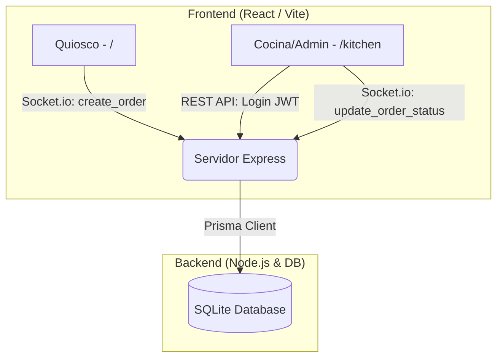

# ☕ Coffee Shop Ordering System

[](https://react.dev/)
[](https://vitejs.dev/)
[](https://tailwindcss.com/)
[](https://expressjs.com/)
[](https://socket.io/)
[](https://www.prisma.io/)
[](https://sqlite.org/)

Una aplicación moderna y ligera de pedidos en tiempo real diseñada para cafeterías locales. Cuenta con un **Quiosco de Clientes** interactivo y un **Panel de Administración y Cocina** protegido por contraseña, todo operado sobre una red local (LAN) y sincronizado de forma instantánea a través de WebSockets.

---

## 🚀 Características Clave

- **Quiosco y Tablero Integrado**: Interfaz en dos columnas para realizar pedidos a la izquierda y visualizar el tablero de turnos compacto a la derecha.
- **Tablero para TV (`/board`)**: Vista a pantalla completa optimizada con tipografía de alta visibilidad para monitores o SmartTVs en el local.
- **Flujo en Tiempo Real Seguro**: Notificaciones y actualizaciones instantáneas sin recargas de página vía **Socket.io** (los clientes anónimos solo reciben datos públicos básicos protegiendo precios y detalles).
- **Panel de Control de Cocina**: Sección protegida por autenticación con **JWT (JSON Web Tokens)** y contraseñas seguras con **Bcrypt**.
- **Base de Datos y Archivador**: Persistencia local con **SQLite** y **Prisma**, que incluye archivado lógico de órdenes finalizadas (`READY` -> `ARCHIVED`) para maximizar rendimiento.
- **Despliegue local (LAN)**: Optimizado para funcionar en redes Wi-Fi locales conectando múltiples terminales.

---

## 🏗️ Arquitectura del Sistema



---

## 📂 Estructura del Proyecto

```
.
├── client/                 # Código del Frontend (React + Vite)
│   ├── src/
│   │   ├── views/          # Vistas principales de la aplicación
│   │   │   ├── KioskView.jsx    # Quiosco y estado de turnos integrado
│   │   │   ├── LoginView.jsx    # Autenticación y registro inicial de admin
│   │   │   ├── KitchenView.jsx  # Gestión de preparación de bebidas
│   │   │   └── BoardView.jsx    # Tablero público a pantalla completa para TV
│   │   ├── App.jsx         # Enrutador principal de React Router
│   │   ├── socket.js       # Configuración y conector dinámico de Socket.io
│   │   ├── index.css       # Estilos globales de Tailwind CSS
│   │   └── main.jsx        # Entrada de ejecución de React
│   └── package.json
├── prisma/                 # Modelado y migración de base de datos
│   ├── schema.prisma       # Esquemas de base de datos (Order, Product, Admin)
│   └── dev.db              # Base de datos SQLite
├── scripts/                # Scripts utilitarios y de arranque
│   ├── dev.js              # Inicializador concurrente de backend y frontend
│   └── seed-admin.js       # Script interactivo para crear usuarios administradores
├── server.js               # Código del Backend (Express + Socket.io Server)
├── .env                    # Configuración de variables de entorno locales
└── package.json            # Scripts de ejecución globales y dependencias
```

---

## ⚙️ Instrucciones de Instalación y Configuración

Sigue estos sencillos pasos para levantar el entorno de desarrollo local:

### 1. Clonar e Instalar Dependencias
Clona el repositorio en tu máquina local, navega a la carpeta principal e instala los paquetes necesarios para el servidor y el cliente:
```bash
npm install
npm --prefix client install
```

### 2. Configurar Variables de Entorno
Crea o edita tu archivo `.env` en la raíz del proyecto para definir la URL de la base de datos y la llave secreta del token JWT:
```env
DATABASE_URL="file:./prisma/dev.db"
PORT=3001
CLIENT_PORT=5173
JWT_SECRET="una_clave_secreta_segura_aqui"
```

### 3. Preparar la Base de Datos
Crea las tablas en tu base de datos SQLite local utilizando Prisma:
```bash
npx prisma db push
npx prisma generate
```

### 4. Crear Credenciales del Administrador (Semilla)
Ejecuta el script interactivo desde la terminal para configurar el usuario y la contraseña con los que accederás al panel de cocina:
```bash
npm run seed:admin
```
*Sigue las instrucciones en pantalla. De forma predeterminada, presionando Enter se configurará el usuario `admin` con la contraseña `admin123`.*

---

## 💻 Ejecución de la Aplicación

Para iniciar el servidor del backend y el frontend concurrentemente, ejecuta:
```bash
npm run dev
```

Una vez iniciados los servicios:
- 🛒 **Quiosco de Clientes:** Abre tu navegador en `http://localhost:5173`
- 📺 **Tablero de Turnos (TV):** Abre tu navegador en `http://localhost:5173/board` para pantalla completa.
- 🍳 **Panel de la Cocina:** Accede a `http://localhost:5173/kitchen` (serás redirigido a `/kitchen/login` para ingresar tus credenciales).

### Despliegue en Red Local (LAN)
Para que los meseros, cocineros o clientes accedan desde otros dispositivos (smartphones, tablets, laptops) conectados a la misma red Wi-Fi:
1. Obtén tu dirección IP local (ej. `192.168.1.45` en Windows a través de `ipconfig`).
2. Indícales que accedan a:
   - Quiosco: `http://192.168.1.45:5173`
   - Tablero de TV: `http://192.168.1.45:5173/board`
   - Cocina: `http://192.168.1.45:5173/kitchen`